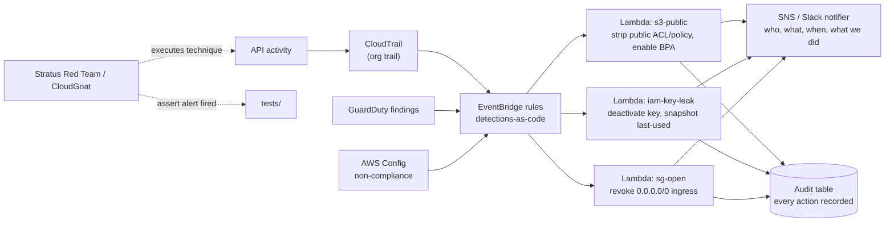
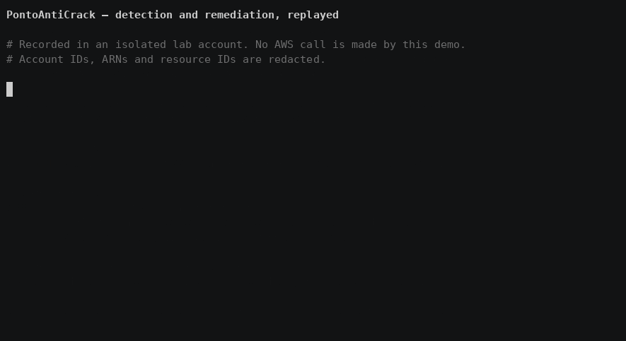

# Sentinel Response

Detection-as-code and automated remediation for AWS: CloudTrail → EventBridge → Lambda, with detections written as tested code and validated by running real attack techniques against the account.

> **Status:** scaffolding. See [Roadmap](#roadmap).

---

## Why

Anyone can enable GuardDuty. The difference between a sysadmin who knows security and a security engineer is: the detection is code, it has tests, and it was proven by attacking the account — not by reading the docs.

## Architecture



Details: [docs/architecture.md](docs/architecture.md).

## Detections

Each detection is a directory: rule (EventBridge pattern), remediation (Lambda), test (fixture event + assertion), and a doc mapping it to MITRE ATT&CK.

| ID | Trigger | Remediation | ATT&CK |
|----|---------|-------------|--------|
| `s3-public` | Bucket ACL/policy grants public read or write | Remove grant, enable Block Public Access, tag `remediated-by` | T1530 Data from Cloud Storage |
| `iam-key-leak` | Access key used from unexpected ASN/geo, or key found exposed | Deactivate key, capture `last-used`, notify owner | T1552 Unsecured Credentials |
| `sg-open` | Security group ingress `0.0.0.0/0` on a sensitive port | Revoke the rule, preserve the original in the audit record | T1190 Exploit Public-Facing App |

## Threat model

Full version in [docs/threat-model.md](docs/threat-model.md).

| # | Threat | Control |
|---|--------|---------|
| T1 | Remediation Lambda is itself over-privileged → escalation path | Per-detection execution role, scoped to the exact API calls and resource conditions |
| T2 | Attacker triggers remediation as a DoS (revoking prod rules) | Dry-run mode, resource tag exclusions, rate limit + circuit breaker, every action reversible from the audit record |
| T3 | Attacker disables the detection path | SCP protects EventBridge rules and Lambda; dead-man's-switch heartbeat alert |
| T4 | Alert fatigue → real finding ignored | Alerts carry context (principal, source IP, resource, blast radius) and are deduplicated |
| T5 | Detection silently stops matching after an AWS event-schema change | Fixture-based tests in CI against recorded CloudTrail events |
| T6 | Slack webhook leaked → alert spoofing / info leak | Webhook in Secrets Manager, no secrets in env vars, no sensitive values in alert text |

## Validation

Detections are proven, not asserted:

- **Unit** — recorded CloudTrail event fixtures → assert the EventBridge pattern matches and the Lambda takes the right action (`moto` for AWS calls).
- **Live** — [Stratus Red Team](https://github.com/DataDog/stratus-red-team) / CloudGoat executes the real technique in an isolated account; the test asserts the alert fired and the resource was remediated, then measures **time to remediate**.

```bash
make test        # unit
make attack      # live technique execution + assertion (isolated account only)
```

## Layout

```
detections/           # EventBridge patterns, one per detection
remediations/*/       # Lambda handler + IAM role policy + README per detection
infra/                # Terraform: trail, rules, functions, roles, audit table
notifier/             # Slack/SNS formatting with context
attack-sim/           # Stratus / CloudGoat scenarios + assertions
tests/                # fixtures + unit tests
docs/                 # architecture, threat model, MITRE mapping, results
```

## Demo



<!-- GIF: stratus detonates s3 public-access technique → Slack alert with context → bucket private again, timer shown -->

## Roadmap

- [ ] `infra/` — CloudTrail + EventBridge + Lambda skeleton in Terraform (reuses [AegisLandingZone](../AegisLandingZone) accounts)
- [ ] `s3-public` detection + remediation + tests
- [ ] `iam-key-leak` detection + remediation + tests
- [ ] `sg-open` detection + remediation + tests
- [ ] Slack notifier with context + dedup
- [ ] Dry-run mode and tag-based exclusions
- [ ] Stratus Red Team scenarios wired to assertions
- [ ] Time-to-remediate measurements per detection
- [ ] MITRE ATT&CK mapping table
- [ ] Demo GIF
