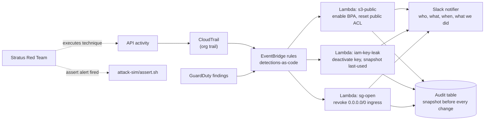

# PAC — Ponto Anti-Crack

Anti-cheat for cloud accounts. Same idea as VAC: the game keeps running, the cheater gets caught and kicked automatically.

Detection-as-code and automated remediation for AWS: CloudTrail → EventBridge → Lambda, with detections written as tested code and validated by running real attack techniques against the account.

> **Status: written, tested locally, never applied.** Three detections, their
> remediations, the Terraform, and the attack scenarios all exist and pass CI.
> Nothing has been deployed to AWS, no technique has been detonated, and every
> event fixture is derived from AWS documentation rather than from an observed
> event. What that does and does not prove is spelled out in
> [What is actually proven](#what-is-actually-proven).
>
> Picking this up cold? Start at **[docs/PAChandoff.md](docs/PAChandoff.md)**.

---

## Why

Anyone can enable GuardDuty. The difference between a sysadmin who knows security and a security engineer is: the detection is code, it has tests, and it was proven by attacking the account — not by reading the docs.

## Architecture



Every detection runs through one pipeline, and the order is the security
property:

```
plan (read-only)  →  exclusion tag  →  SNAPSHOT TO AUDIT TABLE  →
circuit breaker   →  dry-run gate   →  apply  →  audit close  →  alert
```

Handlers implement `plan()` and `apply()` and nothing else. They never call the
audit log, the breaker, or the notifier, so they cannot get the order wrong.

Details and the decision record: [docs/architecture.md](docs/architecture.md).

## Detections

Each detection is a unit: EventBridge pattern, Lambda handler, its own scoped
IAM policy, a README, fixtures, and tests for both what it catches and what it
must not. `scripts/check-detection-coverage.sh` fails CI on a partial one.

| ID | Trigger | Remediation | ATT&CK | Unit tests | Detonated |
|----|---------|-------------|--------|-----------|-----------|
| [`s3-public`](remediations/s3_public/README.md) | ACL / policy / BPA change that can expose a bucket | Enable all four Block Public Access settings; reset a public ACL. **Policy retained as evidence.** | T1530, T1562.001 | ✅ | ❌ |
| [`iam-key-leak`](remediations/iam_key_leak/README.md) | GuardDuty finding ≥ MEDIUM on an access key | Capture `last-used`, set the key **Inactive, never deleted**. Root and temporary credentials escalate instead. | T1552.001, T1078.004 | ✅ | ❌ |
| [`sg-open`](remediations/sg_open/README.md) | Ingress authorised from `0.0.0.0/0` or `::/0` | Revoke **only** the world-open CIDRs on entries covering a sensitive port | T1190, T1021 | ✅ | ❌ |

Full mapping and the deliberate gaps: [docs/mitre-attack.md](docs/mitre-attack.md).

## What is actually proven

This matters more than the table above, so it gets its own section.

**Proven:** 167 unit tests. The patterns match the events their author intended
and reject the plausible-but-benign near-miss. The handlers make the right
call on a `moto`-backed AWS: a wildcard bucket policy scoped by
`aws:PrincipalOrgID` is left alone, 443-to-the-world is left alone, a rule
allowing both `10.0.0.0/8` and `0.0.0.0/0` on port 22 loses only the second, a
root credential finding is escalated and never acted on. The pipeline invariants
hold: the snapshot survives a failed remediation, dry-run changes nothing, the
circuit breaker stops a storm, an alert never carries credential material.

**Proven since 2026-07-30:**

- **EventBridge itself agrees with every pattern on every fixture.** `make
  patterns` replays all fifteen through `aws events test-event-pattern`;
  `docs/evidence/pattern-gate.md`. That closes the ADR-010 limitation: the local
  reimplementation in `tests/support/eventbridge.py` and the service return the
  same verdict on all fifteen.
- **Fourteen of the fifteen fixtures are recorded events**, captured in the lab
  account from real API calls and sanitized;
  `docs/evidence/fixture-capture.md`. The assumption flagged as highest-risk
  held: CloudTrail emits `DeleteBucketPublicAccessBlock`, not the API's
  `DeletePublicAccessBlock`. Real events corrected five assumptions the tests
  around the patterns had encoded.

**Not proven:**

- **The root-credential fixture is still documentation-derived**, so
  `detections/iam-key-leak/metadata.yaml` still says
  `fixture_verified_against_live_event: false`. GuardDuty sample findings always
  carry a placeholder principal and none can be issued against the account root;
  capturing it honestly would mean manufacturing a root compromise.
- **The captured GuardDuty findings are service-generated samples.** Their type,
  severity and resource shape are exactly what GuardDuty emits, which is what
  the pattern reads, but no real compromise produced them.
- **No technique has been detonated and no remediation has run against a real
  resource.** The three Lambdas exist but are not wired to EventBridge: the
  account's regional Lambda concurrency quota is 10, and three functions
  reserving 5 each plus the 10 unreserved executions AWS enforces needs 25. A
  request for the self-service minimum of 1000 is open. Until it lands, no
  latency has been measured and `docs/evidence/` says so.

The capture procedure for each fixture, and the order to apply and verify in, is
in [docs/session-report.md](docs/session-report.md).

## Threat model

Full version, including the four static-analysis suppressions and why each one
is or is not a real finding: [docs/threat-model.md](docs/threat-model.md).

| # | Threat | Control |
|---|--------|---------|
| R1 | Remediation Lambda over-privileged → escalation path | One role per detection, plus explicit `Deny` on the escalation primitives. `sg-open` cannot `Authorize*` anything; `iam-key-leak` cannot `CreateAccessKey` or `PassRole`; `s3-public` cannot read an object |
| R2 | Attacker triggers remediation as a DoS | Dry-run default, `pac:exclude` tag, per-detection circuit breaker **and** reserved concurrency, surgical revokes |
| R3 | Attacker disables the detection path | SCP on `pac-*`, DynamoDB deletion protection, alarms on errors / throttles / dead letters. **No heartbeat canary yet — the largest open gap** |
| R4 | Event schema drift → silent stop | Fixture tests + a coverage guard that requires a negative assertion. **Weakened until the fixtures are real** |
| R5 | Slack webhook leaked | Secrets Manager under a CMK, referenced by ARN, never in an env var or state; payloads scrubbed |
| R6 | Remediation destroys IR evidence | Snapshot before any change; no TTL on audit records; `dynamodb:DeleteItem` and `iam:DeleteAccessKey` denied by IAM |
| R7 | Alert fatigue | Conditional-write dedup with an exact window; benign outcomes do not alert |

## Validation

```bash
make test        # unit — fixtures + moto, no AWS account needed
make lint        # ruff, mypy, terraform fmt, trivy, checkov
make coverage    # fail if any detection is missing a piece of its unit
make validate    # terraform validate — no credentials needed
make attack      # live technique execution — ISOLATED ACCOUNT ONLY
```

`make attack` prints the resolved account ID and requires typed confirmation.
`attack-sim/assert.sh` additionally refuses to run unless
`STRATUS_LAB_ACCOUNT_ID` is exported and equals the caller identity — a stale
SSO session pointed at the wrong account is the realistic failure, and that is
what catches it.

## Layout

```
detections/<id>/       # EventBridge pattern + ATT&CK metadata + fixture provenance
remediations/<pkg>/    # handler.py, policy.json, README.md per detection
remediations/common/   # the pipeline: snapshot, breaker, dry-run, redaction
infra/                 # Terraform: rules, functions, per-detection roles, audit table
notifier/              # Slack formatting with context, deduplicated
attack-sim/            # Stratus scenarios + assertions (written, never run)
tests/                 # fixtures + unit tests + the local pattern evaluator
docs/                  # architecture ADRs, threat model, MITRE mapping, session report
```

## Cost

~USD 2.35/month at rest, against a USD 20/month ceiling shared with
[AwLZ](../AwLZ). Nine CloudWatch alarms (USD 0.90), one KMS CMK (USD 1.00), and
one Secrets Manager secret (USD 0.40) are effectively all of it — Lambda,
EventBridge, DynamoDB on-demand, SQS, and X-Ray are free at this volume.
Breakdown in [docs/session-report.md](docs/session-report.md).

## Demo

<!-- GIF: stratus detonates → Slack alert with context → resource remediated, timer visible.
     Not recorded: nothing has been detonated yet. -->

## Roadmap

- [x] `infra/` — EventBridge + Lambda + per-detection roles + audit table in Terraform
- [x] `s3-public` detection + remediation + tests
- [x] `iam-key-leak` detection + remediation + tests
- [x] `sg-open` detection + remediation + tests
- [x] Slack notifier with context + dedup
- [x] Dry-run mode, tag-based exclusions, circuit breaker
- [x] Stratus Red Team scenarios wired to assertions (written, not run)
- [x] MITRE ATT&CK mapping table
- [ ] **Apply to the lab account**
- [ ] **Capture real CloudTrail events and replace every fixture**
- [ ] Detonate each technique and assert
- [ ] Time-to-remediate measurements per detection
- [ ] Dead-man's-switch heartbeat (threat R3)
- [ ] `ModifySecurityGroupRules` rule for `sg-open`
- [ ] Demo GIF
